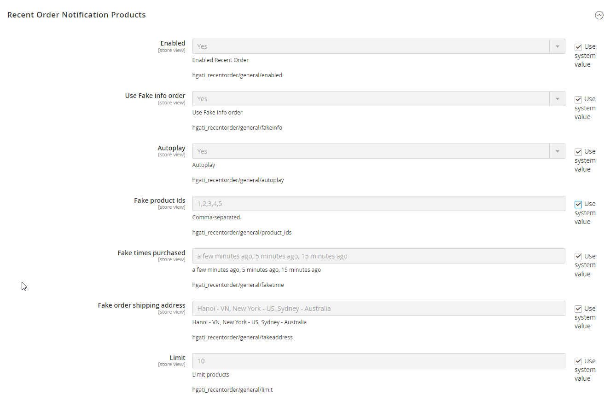
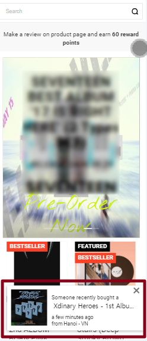

# Someone recently bought a ~ (Magento 2.4.6-p4)
- It display a small pop-up message periodically on the frontend's homepage, saying 'Someone recently ~ purchased"
- fake order / real order

```
composer require hgati/module-someone-recently-bought:dev-master
php bin/magento setup:upgrade
php bin/magento setup:static-content:deploy -f
```

- Store > Configuration > Hgati > Someone Recently Bought



- Screen On Mobile




